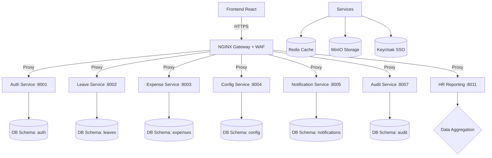

# KRONOS - OpenSpec Documentation

> **Status (Stato)**: Living Document (Documento Vivo)
> **Versione**: 1.5.0
> **Ultimo Aggiornamento**: 2026-01-13
> **Autore**: Antigravity AI (OpenSpec Agent)

---

## 1. Visione del Progetto

**KRONOS** (Κρόνος) è una piattaforma HRMS (Human Resource Management System) Enterprise-grade progettata per la gestione completa e digitalizzata di:
- **Presenze e Assenze**: Ferie, Permessi, ROL, Malattia.
- **Trasferte e Spese**: Pianificazione viaggi, note spese, rimborsi chilometrici.
- **Reporting HR**: Analisi costi, compliance normativa, reportistica LUL.
- **Workflow Approvativi**: Processi multi-livello configurabili.

Il sistema è costruito per garantire **Compliance Normativa Italiana** (D.Lgs 66/2003) e scalabilità enterprise.

### Principi Architetturali Fondamentali
1.  **Zero Hardcoding**: Ogni regola di business è configurata nel database (`system_config`), mai nel codice.
2.  **Database Isolation**: Unico cluster PostgreSQL ma schema separati e isolati per ogni microservizio (`auth`, `leaves`, `expenses`, ecc.).
3.  **Strict Layering**: Architettura a 3 livelli applicata rigorosamente: `Router` -> `Service` -> `Repository` -> `Database`.
4.  **Audit Trail Immutabile**: Ogni operazione di modifica viene tracciata con snapshot `old_value` / `new_value`.
5.  **Security First**: SSO Keycloak obbligatorio, WAF (ModSecurity), Nessun segreto nel codice.

---

## 2. Architettura del Sistema

L'architettura segue il pattern a Microservizi (Logical Microservices in Monorepo) orchestrati via Docker Compose.

### 2.1 Diagramma High-Level

### 2.2 Stack Tecnologico
- **Backend**: Python 3.11+, FastAPI, SQLAlchemy 2.0 (Async), Pydantic V2.
- **Frontend**: React 18, TypeScript, CallStack (React Query), Shadcn/UI, DataTables.net.
- **Infrastructure**: Docker, Nginx (ModSecurity), PostgreSQL 15, Redis, MinIO, Keycloak.
- **Integration**: Brevo (Email), Celery (Async Tasks).

---

## 3. Specifiche Funzionali (Moduli)

### 3.1 Auth & Organizzazione (`auth-service`)
- **Gestione Utenti**: Sync da Keycloak (LDAP/AD).
- **Identity Resolution**: Risoluzione `keycloak_id` (sub) -> `internal_uuid` (db).
- **Struttura**: Gestione gerarchica Aree (Dipartimenti) e Sedi (Locations).
- **Ruoli**: `Admin`, `Manager`, `Employee`, `Approver`.

### 3.2 Gestione Assenze (`leave-service`)
- **Workflow**: `DRAFT` -> `PENDING` -> `APPROVED` / `REJECTED` -> `COMPLETED`.
- **Saldi**: Calcolo in tempo reale di maturate, godute, residue (AP/AC).
- **Policy**: Controlli automatici (preavviso, sovrapposizioni, saldo negativo).
- **Calendari**: Integrazione festività nazionali e patronali per sede.

### 3.3 Spese e Trasferte (`expense-service`)
- **Business Trip**: Richiesta preventiva trasferta (destinazione, motivo, anticipi).
- **Expense Report**: Nota spese associata a trasferta o standalone.
- **Massimali**: Validazione limiti di spesa per categoria (es. Hotel €120/notte).
- **Diarie**: Calcolo automatico indennità trasferta (Italia/Estero).

### 3.4 Configurazioni (`config-service`)
- **System Config**: Gestione centralizzata parametri (JSONB).
- **Holiday Profiles**: Calendari festività personalizzabili.
- **Leave Types**: Definizione dinamica tipi assenza (Ferie, ROL, L104, ecc.).

### 3.5 HR Reporting (`hr-reporting-service`)
- **Dashboard**: KPI in tempo reale (assenti oggi, pending approvals).
- **Compliance**: Report mensile conformità D.Lgs 66/2003 (ferie minime).
- **LUL Export**: Generazione dati per Consulenti del Lavoro.
- **Budgeting**: Analisi costi trasferte e residui ferie.

### 3.6 Audit & logs (`audit-service`)
- **Audit Log**: Registro accessi e operazioni (Chi, Cosa, Quando).
- **Audit Trail**: Versioning completo entità (Snapshot pre/post modifica).

---

## 4. Specifiche Tecniche e Standard

### 4.1 Enterprise Repository Pattern
Tutti i servizi devono seguire strettamente la separazione:
1.  **Router**: Validazione Input (Pydantic), Auth Check.
2.  **Service**: Business Logic, Transaction Management, Audit Logging.
3.  **Repository**: Pure SQL/ORM (Select, Insert, Update). **Nessuna logica qui.**

### 4.2 Gestione Errori
- Eccezioni tipizzate (es. `LeaveBalanceError`, `PolicyViolationError`).
- Risposte HTTP standardizzate (Problem Details RFC 7807).

### 4.3 Sicurezza
- **RBAC**: Permessi granulari su risorse.
- **WAF**: Regole OWASP CRS attive su Nginx.
- **Data Protection**: Nessun dato sensibile nei log applicativi.

---

## 5. Roadmap e Stato Avanzamento

### Completato (Green)
- [x] Infrastruttura base (Docker, DB, SSO).
- [x] Auth Service (Sync utenti).
- [x] Config Service & System Config.
- [x] Leave Service (Core logic & Workflow).
- [x] Expense Service (Trips & Reports).
- [x] Audit Service (Log & Trail).
- [x] **Global Repository Pattern Migration** (v1.3.0).
- [x] **HR Reporting Service** (v1.4.0).

### In Corso / Prossimi Passi (Yellow)
- [ ] Integrazione completa Frontend con HR Reporting.
- [ ] Export PDF nativo per Note Spese.
- [ ] Modulo avanzato gestione turni.

---

## 6. Riferimenti Documentali
Per dettagli implementativi specifici, consultare:
- [Architecture & Network](./architecture.md)
- [Database Schema](./database/schema.md)
- [Compliance Italy](./business/compliance-italy.md)
